# Tech Challenge – Pipeline Híbrido para Análise da Alfabetização no Brasil

Projeto desenvolvido para o **Tech Challenge – Fase 2**, com o objetivo de construir uma pipeline de dados híbrida em nuvem, combinando processamento **Batch + Streaming**, utilizando serviços da **Amazon Web Services (AWS)** e seguindo a **Arquitetura Medalhão**.

A solução integra dados educacionais relacionados ao **Indicador Criança Alfabetizada**, disponibilizados pela plataforma **Base dos Dados**, permitindo ingestão, tratamento, integração, validação de qualidade, disponibilização analítica e monitoramento da pipeline.

---

## 1. Contexto do Problema

A alfabetização na infância é um dos pilares para o desenvolvimento educacional, social e econômico.

Dentro desse contexto, o **Compromisso Nacional Criança Alfabetizada** busca garantir que as crianças brasileiras estejam alfabetizadas ao final do 2º ano do ensino fundamental.

A partir da Pesquisa Alfabetiza Brasil, realizada pelo INEP, foi definido o ponto de corte de **743 pontos na escala de proficiência do Saeb**, utilizado como referência para identificar estudantes alfabetizados.

Com base nesse parâmetro foi criado o **Indicador Criança Alfabetizada**, que representa o percentual de estudantes que atingem o nível esperado de alfabetização.

A análise desse indicador exige a integração de diferentes tipos de dados, incluindo:

- resultados de alfabetização;
- metas nacionais;
- metas por UF;
- metas por município;
- dados de municípios;
- microdados educacionais de alunos.

A integração dessas informações permite comparar resultados e metas, identificar diferenças regionais e produzir dados confiáveis para análises educacionais e apoio a políticas públicas.

---

## 2. Objetivo do Projeto

O projeto tem como objetivo construir uma pipeline de dados escalável em nuvem capaz de:

- realizar ingestão de dados históricos em **Batch**;
- simular ingestão de eventos em **Streaming**;
- armazenar os dados seguindo a Arquitetura Medalhão;
- tratar, limpar e padronizar os dados;
- integrar bases educacionais heterogêneas;
- validar duplicidade, valores ausentes e consistência dos dados;
- integrar dados históricos e eventos de Streaming;
- disponibilizar datasets analíticos confiáveis;
- permitir consultas SQL através do Amazon Athena;
- monitorar execuções e logs;
- aplicar boas práticas de FinOps e otimização de custos.

---

## 3. Fonte de Dados

Os dados históricos são obtidos através da plataforma **Base dos Dados**, utilizando o dataset:

```text
br_inep_avaliacao_alfabetizacao
```

As principais entidades utilizadas são:

- UF;
- Município;
- Meta Alfabetização Brasil;
- Meta Alfabetização por UF;
- Meta Alfabetização por Município;
- Dados de alunos.

A ingestão Batch é realizada pelo script:

```text
src/ingestion/batch/main.py
```

O script consulta os dados através da biblioteca `basedosdados`, utilizando o BigQuery como mecanismo de consulta.

Os arquivos de dados não são versionados diretamente neste repositório. Após a ingestão, os dados são armazenados no Amazon S3.

---

## 4. Arquitetura da Solução

A arquitetura combina processamento histórico e eventos simulados em tempo quase real.

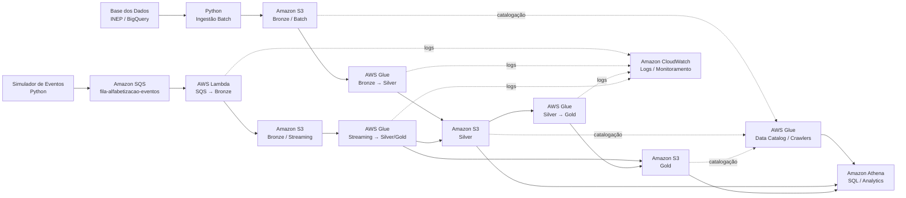

Uma versão separada do diagrama também está disponível em:

```text
docs/architecture/arquitetura.md
```

---

## 5. Arquitetura Medalhão

A solução utiliza três camadas principais no Amazon S3.

### 5.1 Bronze – Raw Data

Responsável por preservar os dados ingeridos antes das principais transformações.

A camada Bronze separa os fluxos de ingestão:

```text
bronze/
├── batch/
└── streaming/
```

- `batch/`: dados históricos obtidos da Base dos Dados;
- `streaming/`: eventos recebidos pelo fluxo SQS + Lambda.

### 5.2 Silver – Dados Tratados

Responsável por limpeza, padronização, validação e integração.

Entre os tratamentos implementados estão:

- remoção de espaços em textos;
- conversão de strings vazias para nulo;
- padronização de tipos;
- normalização de identificadores;
- remoção de registros sem chaves obrigatórias;
- deduplicação;
- validação de taxas, metas, proporções e percentuais;
- integração entre resultados e metas;
- processamento dos eventos Streaming;
- integração entre Batch e Streaming.

Os dados da Silver são gravados em **Parquet**, utilizando compressão **Snappy** e particionamento quando aplicável.

### 5.3 Gold – Camada Analítica

Contém datasets preparados para consultas e análises.

Entre as saídas analíticas estão:

- indicadores por UF;
- indicadores por município;
- comparativos entre resultados e metas;
- painel de metas;
- resumo de alunos por município;
- painel híbrido Batch + Streaming.

---

## 6. Fluxo Batch

O fluxo Batch é utilizado para ingestão e processamento dos dados históricos.

```text
Base dos Dados / BigQuery
        ↓
Python - src/ingestion/batch/main.py
        ↓
Amazon S3 - Bronze / Batch
        ↓
AWS Glue - job-bronze-para-silver
        ↓
Amazon S3 - Silver
        ↓
AWS Glue - job-silver-para-gold
        ↓
Amazon S3 - Gold
        ↓
Amazon Athena
```

### Etapas

1. O script Python consulta as entidades da Base dos Dados.
2. Os dados são organizados na camada Bronze.
3. O job `job-bronze-para-silver` realiza limpeza e padronização.
4. As tabelas tratadas são disponibilizadas na Silver.
5. O job `job-silver-para-gold` cria datasets analíticos.
6. O Glue Data Catalog disponibiliza as tabelas para consulta no Athena.

---

## 7. Fluxo Streaming

O fluxo Streaming simula eventos de atualização de indicadores.

```text
Simulador de eventos
        ↓
Amazon SQS
fila-alfabetizacao-eventos
        ↓
AWS Lambda
lambda-sqs-para-bronze-streaming
        ↓
Amazon S3
bronze/streaming/indicadores
        ↓
AWS Glue
job-streaming-para-silver-gold
        ↓
Silver + Gold
        ↓
Amazon Athena
```

Os principais arquivos desse fluxo são:

```text
src/ingestion/streaming/simulador_streaming.py
src/ingestion/streaming/lambda-sqs-para-bronze-streaming.py
src/glue/job-streaming-para-silver-gold.py
```

O simulador envia eventos para a fila SQS. A Lambda recebe as mensagens e grava os eventos na Bronze.

O job de Streaming:

- lê os JSONs da Bronze;
- padroniza os campos;
- valida os eventos;
- separa registros rejeitados;
- remove duplicidades por `evento_id`;
- mantém o evento mais recente por localidade;
- integra os eventos com a base histórica;
- grava tabelas Silver;
- cria o painel híbrido na Gold.

> A ingestão até a Bronze utiliza eventos assíncronos via SQS + Lambda. A atualização das camadas analíticas ocorre na execução do job Glue, portanto a solução representa um cenário de **tempo quase real**, e não processamento de baixa latência em milissegundos.

---

## 8. Integração Batch + Streaming

A integração entre os dois fluxos é consolidada no dataset:

```text
alfabetizacao_gold_db.painel_hibrido_atual
```

O painel permite analisar:

- taxa histórica do Batch;
- taxa recebida no Streaming;
- meta correspondente ao ano;
- variação Streaming vs Batch;
- gap entre Streaming e meta;
- situação da meta;
- correspondência entre as duas fontes.

Durante a validação final, as **5 localidades simuladas** apresentaram:

```text
status_correspondencia = Correspondente
```

### Evidência

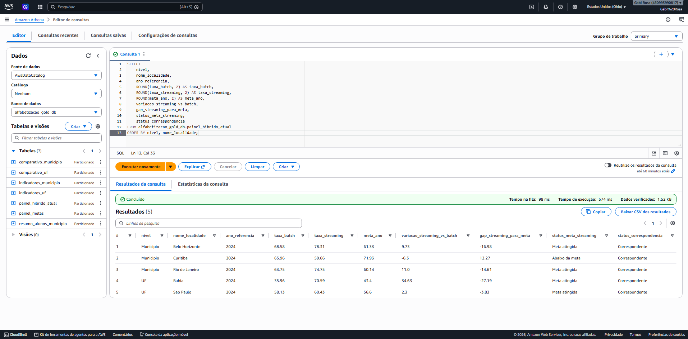

---

## 9. Tecnologias Utilizadas

| Tecnologia | Utilização |
|---|---|
| Python | Ingestão Batch e simulação de eventos |
| Base dos Dados | Fonte dos dados educacionais |
| Google BigQuery | Mecanismo utilizado pela Base dos Dados para consulta |
| Amazon S3 | Data Lake e armazenamento Bronze, Silver e Gold |
| AWS Glue | Processamento ETL |
| Apache Spark / PySpark | Transformações executadas nos jobs Glue |
| AWS Glue Data Catalog | Catálogo das tabelas |
| AWS Glue Crawlers | Descoberta/catalogação de datasets |
| Amazon Athena | Consultas SQL sobre o Data Lake |
| Amazon SQS | Fila de eventos do fluxo Streaming |
| AWS Lambda | Consumo da fila e persistência na Bronze |
| Amazon CloudWatch | Logs e observabilidade |
| Git / GitHub | Versionamento do projeto |

---

## 10. Qualidade de Dados

A pipeline possui validações tanto no processamento Batch quanto no Streaming.

### Batch / Silver

Entre as regras aplicadas no job Bronze → Silver estão:

- exclusão de registros sem chaves obrigatórias;
- deduplicação pelas chaves de cada entidade;
- padronização dos tipos;
- identificadores tratados como texto;
- validação de taxas, metas, percentuais e proporções no intervalo entre `0` e `100`;
- padronização de valores vazios.

### Streaming

O job Streaming valida, entre outros pontos:

- `evento_id`;
- `timestamp_evento`;
- ano de referência;
- nível geográfico;
- sigla da UF;
- identificador de município;
- taxa de alfabetização;
- média de português;
- proporção de níveis adequados.

Eventos inválidos podem ser separados para uma área de qualidade no S3 e os eventos válidos são deduplicados antes da integração.

Além das validações do ETL, foi executada uma validação final no Amazon Athena.

| Validação | Problemas encontrados |
|---|---:|
| `evento_id_nulo` | 0 |
| `timestamp_nulo` | 0 |
| `taxa_fora_intervalo` | 0 |
| `evento_id_duplicado` | 0 |

As consultas utilizadas estão disponíveis em:

```text
sql/quality_checks.sql
sql/athena_queries.sql
```

### Evidência

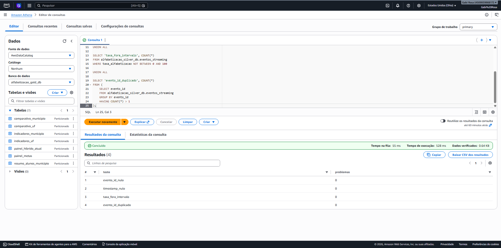

---

## 11. Monitoramento e Observabilidade

O monitoramento é realizado principalmente através do **Amazon CloudWatch** e dos históricos de execução do AWS Glue.

Foram utilizados logs para acompanhar:

- execução da Lambda;
- processamento de mensagens SQS;
- execução dos jobs Glue;
- erros dos jobs;
- logs dos Crawlers.

Principais grupos observados:

```text
/aws-glue/crawlers
/aws-glue/jobs/error
/aws-glue/jobs/logs-v2
/aws-glue/jobs/output
/aws/lambda/lambda-sqs-para-bronze-streaming
```

O histórico de execução do Glue também permite verificar:

- status da execução;
- duração;
- capacidade utilizada;
- horário da execução.

### Evidências

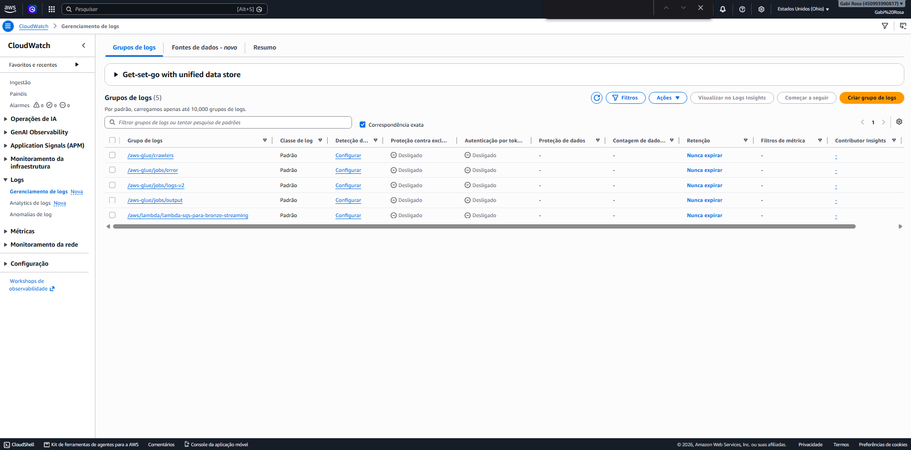

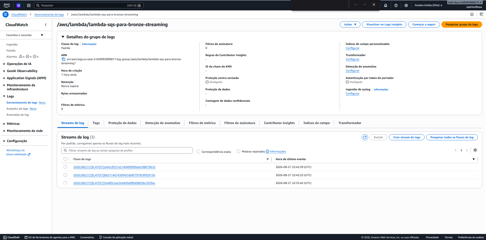

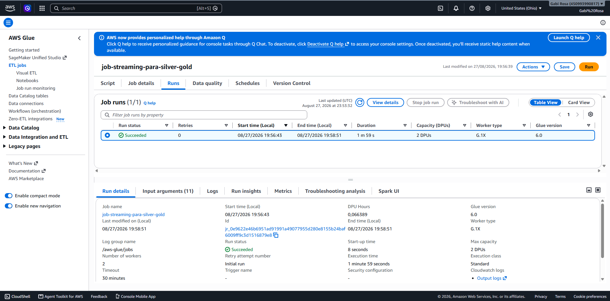

> A solução demonstra observabilidade através de logs e histórico de execução. Alarmes automáticos do CloudWatch podem ser adicionados como evolução futura para notificação proativa de falhas.

---

## 12. FinOps e Otimização de Custos

A arquitetura foi desenvolvida priorizando serviços gerenciados, processamento sob demanda e redução do volume de dados lidos e armazenados.

### Custo observado durante o projeto

Durante a implementação, a conta AWS utilizada estava no **Free Plan**.

No momento da coleta da evidência, o próprio console da AWS informava que a conta não estava sendo cobrada e que os dados detalhados de custo e uso ainda estavam sendo processados, podendo levar até 24 horas para ficarem disponíveis.

Evidência:

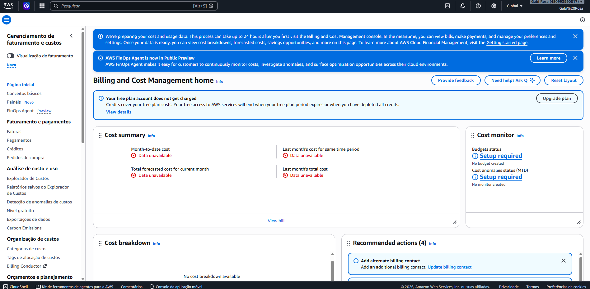

Por esse motivo, o valor observado durante a execução acadêmica do projeto foi **US$ 0,00 em cobrança efetiva até o momento da documentação**.

Esse valor não deve ser interpretado como o custo permanente da arquitetura em produção, pois depende dos créditos, plano da conta, volume de dados e frequência de execução.

### Estimativa de custo

Para demonstrar o comportamento de custo fora do cenário acadêmico, foi considerado um exemplo de utilização mensal:

- 3 jobs AWS Glue;
- 2 DPUs por job;
- aproximadamente 2 minutos por execução;
- 10 execuções mensais de cada job;
- 100 consultas Athena por mês;
- baixo volume de eventos SQS/Lambda;
- volume de logs inferior a 5 GB/mês.

#### AWS Glue

O AWS Glue cobra por DPU-hora. Considerando **US$ 0,44 por DPU-hora**:

```text
3 jobs × 10 execuções × 2 DPUs × (2 / 60 hora) × US$ 0,44
≈ US$ 0,88 / mês
```

O Glue tende a representar a principal parcela de custo computacional desta arquitetura em um cenário de baixo volume.

#### Amazon Athena

O Athena cobra conforme a quantidade de dados verificados pelas consultas.

O uso de **Parquet, compressão e particionamento** reduz significativamente o volume lido. Considerando consultas pequenas e um volume acadêmico de uso, o custo tende a permanecer muito baixo.

#### AWS Lambda e Amazon SQS

A arquitetura utiliza Lambda e SQS apenas durante o processamento dos eventos simulados. Para o volume acadêmico utilizado, a quantidade de execuções e mensagens é pequena, contribuindo pouco para o custo total da solução.

#### Amazon CloudWatch

O volume de logs produzido pela pipeline é reduzido. O custo depende principalmente da quantidade de logs ingeridos e do período de retenção configurado.

#### Amazon S3

O custo depende do volume armazenado, da quantidade de requisições e da classe de armazenamento.

Como os datasets tratados são armazenados em **Parquet com compressão**, o volume necessário é menor do que seria com o armazenamento analítico exclusivamente em CSV.

### Estimativa consolidada

Para um cenário acadêmico ou de demonstração, com poucas execuções mensais, a arquitetura apresenta um custo operacional estimado **próximo de US$ 1 por mês**, desconsiderando créditos e benefícios do Free Plan.

A estimativa é ilustrativa e pode variar conforme:

- região AWS;
- volume armazenado;
- frequência dos jobs;
- DPUs utilizadas;
- quantidade e tamanho das consultas;
- volume de eventos;
- retenção dos logs.

### Estratégias adotadas para redução de custos

#### Parquet

As camadas tratadas utilizam formato colunar Parquet, reduzindo a quantidade de dados lidos durante consultas analíticas.

#### Compressão Snappy

Os arquivos tratados utilizam compressão Snappy, diminuindo o espaço ocupado sem comprometer significativamente a velocidade de leitura.

#### Particionamento

Os datasets são particionados por campos como ano e data de ingestão, evitando leitura desnecessária de arquivos.

#### Processamento sob demanda

Os jobs AWS Glue são executados somente quando necessário, sem manter infraestrutura computacional ativa permanentemente.

#### Serviços gerenciados e serverless

Foram priorizados serviços como:

- Amazon S3;
- Amazon Athena;
- AWS Lambda;
- Amazon SQS;
- AWS Glue.

Essa abordagem reduz a necessidade de manter servidores dedicados continuamente ativos.

#### Camada Gold otimizada

As agregações são realizadas previamente na Gold, evitando que consultas analíticas recorrentes precisem reprocessar os microdados completos.

---

## 13. Decisões Arquiteturais e Trade-offs

### Batch vs Streaming

**Batch** foi utilizado para bases históricas, pois os dados educacionais de origem não precisam ser processados continuamente.

**Streaming** foi utilizado para representar atualizações de indicadores e novas medições.

A combinação dos dois permite manter um histórico consolidado e, ao mesmo tempo, simular atualizações mais recentes.

### Data Lake vs Data Warehouse

Foi adotado um **Data Lake no Amazon S3**.

Vantagens:

- baixo acoplamento entre armazenamento e processamento;
- flexibilidade de formatos;
- separação das camadas Bronze, Silver e Gold;
- integração nativa com Glue e Athena;
- armazenamento econômico para o cenário do projeto.

Um Data Warehouse dedicado poderia oferecer recursos adicionais para BI de alta concorrência, porém adicionaria custo e complexidade desnecessários para o escopo atual.

### Custo vs Performance

A solução prioriza equilíbrio entre custo e desempenho através de:

- Parquet;
- compressão;
- particionamento;
- datasets Gold pré-processados;
- execução sob demanda;
- serviços gerenciados.

O uso do Glue adiciona custo durante o processamento, mas evita manter infraestrutura Spark própria.

### SQS + Lambda vs Plataforma de Streaming dedicada

O uso de **SQS + Lambda** simplifica a simulação de eventos e reduz a complexidade operacional.

Para cenários de Streaming de altíssimo volume e baixa latência, tecnologias como Amazon Kinesis ou Apache Kafka poderiam ser consideradas.

Para o escopo acadêmico, SQS + Lambda atende ao objetivo de demonstrar ingestão orientada a eventos com menor complexidade.

---

## 14. Datasets Analíticos da Gold

Entre as tabelas disponibilizadas na camada Gold estão:

```text
indicadores_uf
indicadores_municipio
painel_metas
resumo_alunos_municipio
comparativo_uf
comparativo_municipio
painel_hibrido_atual
```

Esses datasets permitem análises como:

- ranking de alfabetização por UF;
- ranking de municípios;
- comparação entre resultado e meta;
- gap para metas anuais;
- acompanhamento da meta de 2030;
- situação de cada localidade;
- análise agregada de alunos;
- comparação entre histórico Batch e eventos Streaming.

---

## 15. Aplicações Futuras em Inteligência Artificial

A camada Gold foi estruturada para permitir consumo por ferramentas analíticas e futuros modelos de Machine Learning.

### Predição de alfabetização

Os dados históricos podem ser utilizados para treinar modelos que estimem a evolução da taxa de alfabetização.

### Identificação de localidades em risco

Variáveis como taxa atual, meta, gap e evolução histórica podem apoiar modelos de classificação de municípios ou UFs com maior risco de não atingir as metas.

### Análise de desigualdade educacional

A integração com dados socioeconômicos, territoriais e de infraestrutura escolar poderia permitir análises mais profundas sobre fatores associados à alfabetização.

### Apoio a políticas públicas

Modelos analíticos podem ser utilizados para priorização de recursos e identificação de regiões que demandam maior atenção.

Possíveis fontes externas para evolução futura:

- Censo Escolar;
- IBGE / Censo / PNAD;
- Atlas do Desenvolvimento Humano;
- Cadastro Único;
- FUNDEB.

---

## 16. Estrutura do Repositório

```text
tech-challenge-alfabetizacao/
│
├── README.md
├── .gitignore
├── requirements.txt
│
├── data/
│   └── README.md
│
├── docs/
│   ├── architecture/
│   │   └── arquitetura.md
│   │
│   └── evidences/
│       ├── athena/
│       │   ├── integracao-batch-streaming.png
│       │   └── quality-checks-streaming.png
│       ├── glue/
│       │   ├── jobs.png
│       │   └── job-streaming-success.png
│       ├── monitoring/
│       │   ├── cloudwatch-log-groups.png
│       │   └── lambda-log-streams.png
│       ├── finops/
│       │   └── billing-free-plan.png
│       ├── s3/
│       │   ├── bronze.png
│       │   ├── silver.png
│       │   └── gold.png
│       └── streaming/
│           ├── sqs-fila-alfabetizacao.png
│           └── lambda-sqs-trigger.png
│
├── sql/
│   ├── athena_queries.sql
│   └── quality_checks.sql
│
└── src/
    ├── glue/
    │   ├── job-bronze-para-silver.py
    │   ├── job-silver-para-gold.py
    │   └── job-streaming-para-silver-gold.py
    │
    └── ingestion/
        ├── batch/
        │   └── main.py
        │
        └── streaming/
            ├── lambda-sqs-para-bronze-streaming.py
            └── simulador_streaming.py
```

---

## 17. Como Executar

### Pré-requisitos locais

- Python 3;
- credenciais/autenticação necessárias para consultar a Base dos Dados;
- projeto de billing no Google Cloud para consultas BigQuery;
- credenciais AWS configuradas para o simulador de Streaming;
- acesso aos recursos AWS utilizados pela pipeline.

### Instalar dependências

```bash
pip install -r requirements.txt
```

Dependências locais principais:

```text
basedosdados
boto3
```

### Ingestão Batch

```bash
python src/ingestion/batch/main.py
```

O script também possui opções para controlar os downloads, como:

```bash
python src/ingestion/batch/main.py --pular-alunos
python src/ingestion/batch/main.py --limite-alunos 10000
python src/ingestion/batch/main.py --sobrescrever
```

### Simulação Streaming

```bash
python src/ingestion/streaming/simulador_streaming.py
```

O simulador envia eventos para o Amazon SQS. A Lambda configurada como consumidora da fila persiste os eventos na Bronze.

### Processamento AWS

Os jobs do AWS Glue responsáveis pelas transformações são:

```text
job-bronze-para-silver
job-silver-para-gold
job-streaming-para-silver-gold
```

Após o processamento, os dados podem ser validados através das consultas disponíveis em:

```text
sql/athena_queries.sql
sql/quality_checks.sql
```

---

## 18. Evidências da Implementação

### Amazon S3

**Bronze**

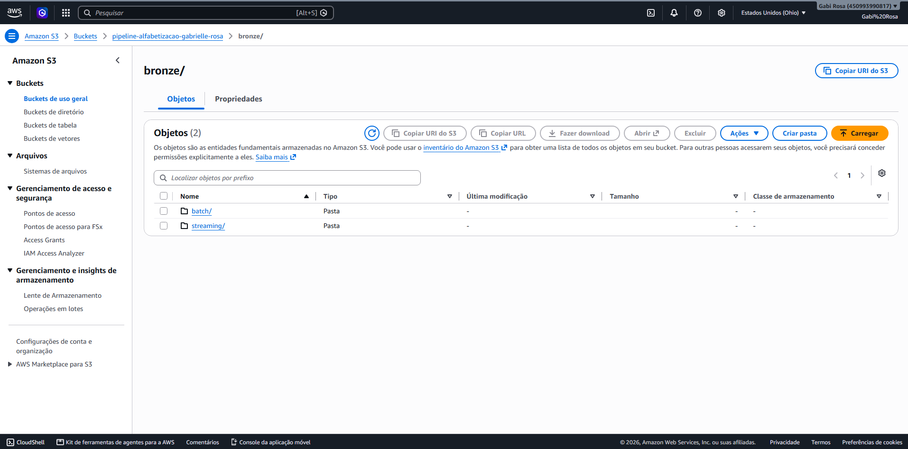

**Silver**


**Gold**

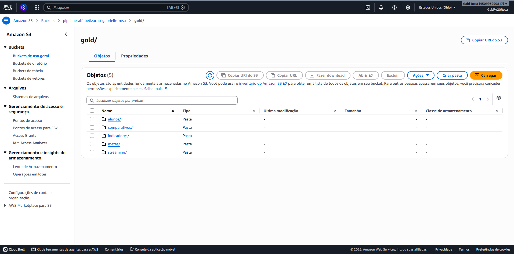

### AWS Glue

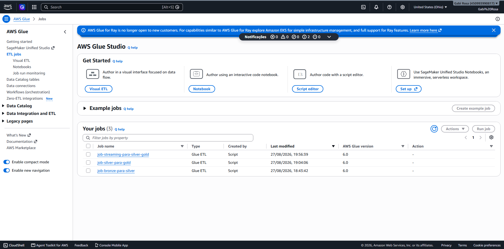


### Streaming

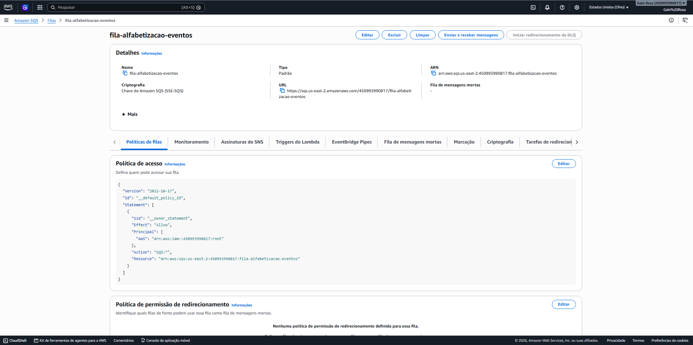

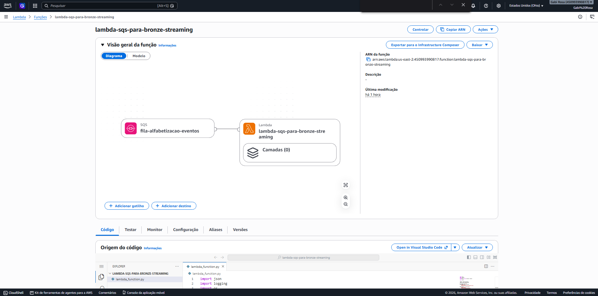

### Amazon Athena


### CloudWatch


### FinOps


---

## 19. Resultados Obtidos

A implementação final demonstrou:

- ingestão histórica Batch;
- ingestão de eventos simulados;
- armazenamento Bronze separado por Batch e Streaming;
- tratamento e padronização na Silver;
- datasets analíticos na Gold;
- integração entre resultados e metas;
- integração Batch + Streaming;
- catalogação para consultas SQL;
- validações de qualidade;
- deduplicação de eventos;
- monitoramento através de logs;
- consultas analíticas no Athena.

Na validação final do Streaming:

```text
evento_id_nulo       = 0
timestamp_nulo       = 0
taxa_fora_intervalo  = 0
evento_id_duplicado  = 0
```

Além disso, as cinco localidades utilizadas na validação híbrida apresentaram correspondência entre Batch e Streaming.

---

## 20. Limitações e Evoluções Futuras

A solução foi desenvolvida para um cenário acadêmico e de demonstração.

Possíveis evoluções incluem:

- automação completa da ingestão Batch através de agendamento;
- execução automática do Glue após chegada de novos eventos;
- alarmes do CloudWatch para falhas e métricas operacionais;
- dashboards em ferramenta de BI;
- integração com fontes socioeconômicas externas;
- uso de Kinesis ou Kafka para cenários de Streaming de maior volume;
- políticas adicionais de governança e segurança;
- infraestrutura como código;
- treinamento de modelos de Machine Learning utilizando a camada Gold.

---

## 21. Versionamento

O repositório deve manter histórico de evolução através do Git, utilizando:

- commits pequenos e descritivos;
- branches para novas funcionalidades;
- Pull Requests para integração na branch principal;
- documentação das mudanças relevantes.

Exemplos de mensagens de commit:

```text
feat: adiciona ingestao batch da Base dos Dados
feat: implementa camada silver no AWS Glue
feat: cria datasets analiticos na camada gold
feat: adiciona pipeline streaming com SQS e Lambda
feat: integra dados batch e streaming
test: adiciona validacoes de qualidade no Athena
docs: adiciona arquitetura e evidencias da AWS
docs: finaliza README do Tech Challenge
```

---

## 22. Conclusão

A solução implementa uma pipeline híbrida de dados educacionais em AWS, combinando processamento histórico e eventos simulados em tempo quase real.

A utilização da Arquitetura Medalhão permite separar claramente dados brutos, tratados e analíticos, enquanto Glue, Athena, SQS, Lambda e CloudWatch fornecem processamento, consulta, integração orientada a eventos e observabilidade.

A camada Gold disponibiliza dados preparados para análises educacionais e cria uma base que pode ser expandida futuramente para dashboards, análises estatísticas e aplicações de Inteligência Artificial.
